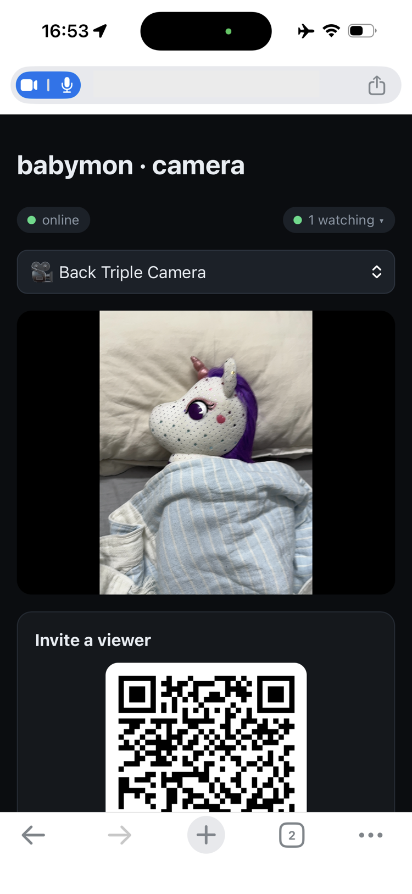
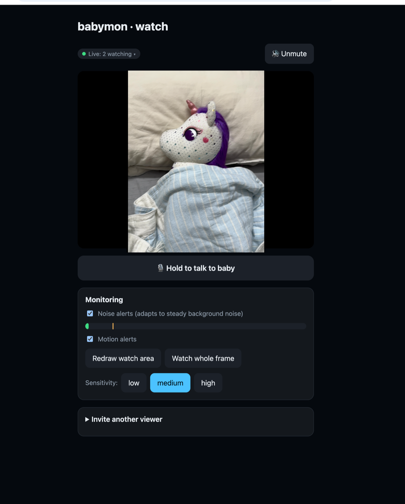

# babymon

A baby monitor that runs entirely in the browser, with noise and motion
alerts, two-way talk, and a connections panel that shows exactly who is
watching and how. Point a spare phone at the crib, open a link on your own
phone — video streams peer-to-peer over WebRTC, on your LAN or across the
internet. Self-hosted, open source, no accounts, no cloud in the media path.

- **Camera**: any spare phone (designed/tested iPhone-first) on a charger with
  the page open. Persistent room code, shown as a QR/link.
- **Viewers** (up to 2): open the link, watch live, talk back, get alerted
  when the baby stirs or cries.
- **Server**: one small container — serves the app, relays a few KB of
  signaling per session, and mints ephemeral TURN credentials. Video never
  touches it (except via optional coturn relay when direct P2P is impossible).

<p align="center">
  
  &nbsp;&nbsp;
  
</p>
<p align="center"><sub>The camera page on the nursery phone (left) and the watch page on a viewer's device (right).</sub></p>

## Features

- **Noise alerts that understand white noise** — the sound threshold adapts
  to steady background noise (white-noise machines, fans, AC), so it alerts
  on a cry rising above the hum, not on the hum itself. Three sensitivity
  levels.
- **Motion alerts with a drawable watch area** — draw a box over just the
  crib and movement elsewhere in the frame (curtains, pets, a parent walking
  by) is ignored. Or watch the whole frame.
- **Push-to-talk** — hold a button to soothe the baby through the camera
  phone's speaker; the mic is live only while you hold it.
- **Invite by QR or link** — the room code travels in the URL fragment, so
  the full link never appears in server logs. Viewers can hand off to another
  person (e.g. the other parent) with their own QR. Regenerating the code
  instantly kicks everyone.
- **"Who's connected" panel** — both sides see every connected device with
  its IP, country flag with GeoIP detail on hover, and the actual media route:
  same LAN, direct over the internet, or via the TURN relay.
- **Camera & mic pickers** — switch between front/back/ultra-wide cameras and
  microphones on the camera page, live, without dropping viewers.
- **Survives real life** — the camera recovers automatically after an
  incoming phone call kills the capture, keeps the screen awake (with a dim
  mode to save the battery), and viewers reconnect on their own after network
  blips.
- **Private by construction** — media is end-to-end encrypted (DTLS-SRTP)
  between the two browsers; rooms are ephemeral and the server stores
  nothing. Optional password wall in front of the whole app
  ([basic auth via Caddy](docs/self-hosting.md#optional-password-protect-the-whole-app)).

## Try it in 2 minutes (no server needed)

On any macOS/Windows/Linux machine with [Node.js](https://nodejs.org) 22+:

```sh
git clone https://github.com/ramnique/babymon && cd babymon
corepack enable && pnpm install && pnpm dev
```

Open `http://localhost:5173` in two browser windows — one as camera, one as
viewer. To point your actual phone at it, see
[trying it on your own computer](docs/self-hosting.md#try-it-on-your-own-computer-first-macos--windows)
— a free Cloudflare quick tunnel gives your machine a temporary HTTPS URL.

## Self-hosting

Requirements: any Linux host running Docker with a public IP (a $5 VPS is
plenty), and a domain pointing at it. HTTPS is included — a bundled Caddy
container obtains and renews the Let's Encrypt certificate automatically
(browsers require HTTPS for camera access).

```sh
git clone https://github.com/ramnique/babymon && cd babymon
cp .env.example .env        # set PUBLIC_HOST and a random TURN_SECRET
docker compose up -d --build
```

Point your domain's DNS at the server *before* the first start so Caddy can
obtain the certificate. That's the whole deployment.

Step-by-step guides: **[Self-hosting guide](docs/self-hosting.md)** (deploy,
updating, TURN verification, troubleshooting) with provider walkthroughs for
[DigitalOcean](docs/hosting/digitalocean.md),
[AWS Lightsail](docs/hosting/aws-lightsail.md), and
[Hetzner](docs/hosting/hetzner.md).

Prefer your own reverse proxy (nginx/Traefik)? Remove the `caddy` service,
re-expose `app` on 8080, and remember the WebSocket upgrade headers for `/ws`
and `X-Forwarded-For` (used for rate limiting).

### Ports to open

| Port | Protocol | What |
|---|---|---|
| 80 + 443 | TCP (+443 UDP for HTTP/3) | HTTPS via bundled Caddy |
| 3478 | UDP + TCP | TURN (coturn) |
| 49160–49200 | UDP | TURN relay range |

The TURN ports are only *needed* by the ~10–20% of network combinations that
can't connect peer-to-peer (strict NATs, some mobile carriers). Everything
still works without them for everyone else.

### LAN-only use

Skip the ports/coturn entirely — devices on the same Wi-Fi connect directly.
You still need HTTPS (or `localhost`) for camera permission; for a quick LAN
setup use [mkcert](https://github.com/FiloSottile/mkcert) with your machine's
LAN IP, or run behind Tailscale which provides certificates.

## How it works

```
        setup only (~KBs, via wss:// through your reverse proxy)
camera ──ws── app container (rooms, relay, TURN creds) ──ws── viewer
   │                                                            │
   └────────── coturn (STUN/TURN, ports 3478 + relay) ──────────┘

        live media (P2P where possible, coturn relay otherwise)
camera ═══════════ encrypted SRTP audio/video ═══════════▶ viewer
```

- The **room code** (~100 bits of entropy, generated on the camera device,
  never stored server-side) is the only credential. Share it as QR/link;
  regenerate it to kick every viewer. Join attempts are rate-limited per IP.
- Signaling is a dumb relay: offer/answer/ICE pass through opaque.
- TURN credentials are ephemeral HMACs (coturn `use-auth-secret`), issued only
  after a successful room join.
- Media is DTLS-SRTP end-to-end between the two browsers; a TURN relay, when
  used, forwards ciphertext it cannot read.

## Development

```sh
pnpm install
pnpm dev          # server on :8080, web (Vite) on :5173 with /ws proxied
pnpm test         # vitest across the workspace
pnpm typecheck
pnpm build
```

Monorepo layout:

| Path | What |
|---|---|
| `apps/web` | React + Vite app (camera, viewer, monitoring UI) |
| `apps/server` | Hono + WebSocket signaling server, TURN cred minting |
| `packages/shared` | zod-typed signaling protocol + room-code generation |
| `packages/detection` | pure-TS noise/motion detection (runs viewer-side today, camera-side later) |

The full design and milestone plan is in [PLAN.md](PLAN.md).

## License

MIT
